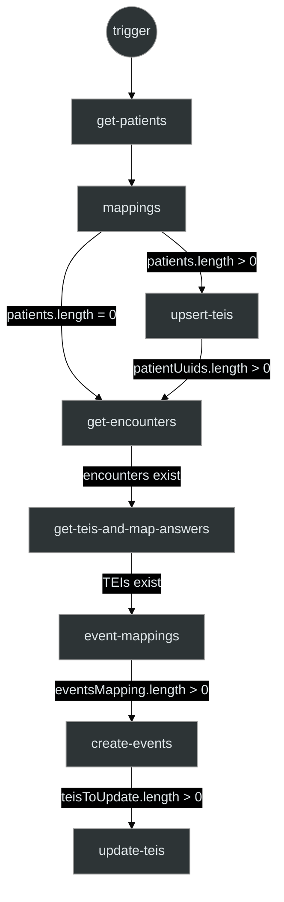

```mermaid
%%{init: {
  'theme': 'base',
  'themeVariables': {
    'darkMode': true,
    'primaryColor': '#2d3436',
    'primaryBorderColor': '#999',
    'primaryTextColor': '#dfe6e9'
  }
}}%%
graph TD
    trigger((trigger)) --> get-patients
    get-patients[get-patients] --> mappings
    mappings -->|patients.length > 0| upsert-teis
    mappings -->|patients.length = 0| get-encounters
    upsert-teis -->|patientUuids.length > 0| get-encounters
    get-encounters -->|encounters exist| get-teis-and-map-answers
    get-teis-and-map-answers -->|TEIs exist| event-mappings
    event-mappings -->|eventsMapping.length > 0| create-events
    create-events -->|teisToUpdate.length > 0| update-teis
```